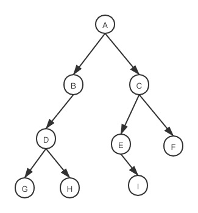
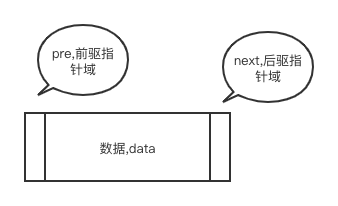
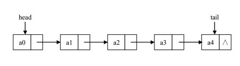
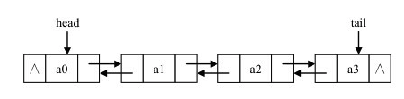
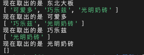
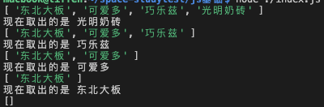

## 集合的概念和用途

- 集合是一种包含不同元素数据结构

- 当想要创建一个数据结构，用来保存一端独一无二的文字的时候集合就非常有用
- 集合的成员是无序的
- 集合不允许相同成员存在

## 集合关键概念

- 集合是一组无序但彼此之间又有一定相关性的成员构成的，集合中的元素称为成员

- 不包含任何成员的集合称为**空集**，**全集**则包含一切可能成员的集合
- 如果两个集合的成员完全相同，则称为两个集合**相等**
- 如果一个集合中的所有成员都属于另外一个集合，则前一个集合称为后一个集合的子集
- **并集**：将两个集合的成员进行合并，得到一个新的集合
- **交集**：两个集合共同存在的成员组成一个新的集合
- **补集**：属于一个集合不属于另外一个集合的成员组成的集合

## 代码实现

```js
function Set() {
  this.dataStore = [];
  this.add = add;
  this.remove = remove;
  this.show = show;
  this.union = union;
  this.intersect = intersect;
  this.difference = difference;
  this.contains = contains;
  this.size = size;
  this.subset = subset;
}
//新增
function add(data) {
  if (this.dataStore.indexOf(data) === -1) {
    this.dataStore.push(data);
  } else {
    return false;
  }
}

//删除
function remove(data) {
  var index = this.dataStore.indexOf(data);
  if (index > -1) {
    this.dataStore.splice(index, 1);
  } else {
    return false;
  }
}

//显示
function show() {
  return this.dataStore;
}

//并集
function union(set) {
  var tempSet = new Set();
  for (let i = 0; i < this.dataStore.length; i++) {
    tempSet.add(this.dataStore[i]);
  }
  for (let i = 0; i < set.dataStore.length; i++) {
    if (tempSet.contains(set.dataStore[i])) {
      tempSet.add(set.dataStore[i]);
    }
  }
  return tempSet;
}
function contains(data) {
  if (this.dataStore.indexOf(data) > -1) {
    return true;
  } else {
    return false;
  }
}
//交集
function intersect(set) {
  var tempSet = new Set();
  for (let i = 0; i < this.dataStore.length; i++) {
    if (set.contains(this.dataStore[i])) {
      tempSet.add(this.dataStore[i]);
    }
  }
  return tempSet;
}
//补集
function difference(set) {
  var tempSet = new Set();
  for (let i = 0; i < this.dataStore.length; i++) {
    if (!set.contains(this.dataStore[i])) {
      tempSet.add(this.dataStore[i]);
    }
  }
  return tempSet;
}

//判断是不是子集
function size() {
  return this.dataStore.length;
}

function subset(set) {
  if (set.size() > this.size()) {
    return false;
  } else {
    for (let i = 0; i < set.dataStore.length; i++) {
      if (!this.contains(set.dataStore[i])) {
        return false;
      }
    }
    return true;
  }
}

var names = new Set();
names.add('小红');
names.add('小里');
names.add('小蓝');
names.add('小张');
names.add('小李');

var cis = new Set();
cis.add('小张');
cis.add('小李');
// console.log(cis)

// var newArr=new Set();
console.log('并集：', names.union(cis).show()); //"小红", "小里", "小蓝", "小张", "小李"]
console.log('交集：', names.intersect(cis).show()); //"小张", "小李"
console.log('bu集：', names.difference(cis).show()); //"小红", "小里", "小蓝"
console.log('cis是不是names的子集', names.subset(cis)); //true
```

## 树的衍生

- 无序树:树中任意节点的子结点之间没有顺序关系，这种树称为无序树,也称为自由树

- 有序树:树中任意节点的子结点之间有顺序关系
- 二叉树:每个节点最多含有两个子树的树称为二叉树
- 完全二叉树:除了最后一层，其它各层节点数都达到最大
- 满二叉树:每一层上的结点数都是最大结点数
- 霍夫曼树:带权路径最短的二叉树，也叫最优二叉树

## 二叉树概念

- 树由一组以边连接的节点组成

- 在一个树最上面的节点称为根节点，如果一个节点下面连接多个节点，那么该节点称为父节点，他下面的节点被称为子节点，一个节点可以有 0 个、1 个或多个子节点，没有任何子节点的节点称为叶子节点
- 二叉树是一种特殊的树，子节点个数不超过两个
- 从一个节点走到另一个节点的这一组边为路径
- 以某种特定顺序访问书中的所有节点称为树的遍历
- 树分为几个层次，根节点是第 0 层，他的子节点是第一层，以此类推，我们定义树的层树就是树的深度
- 每个节点都有一个与之相关的值，该值有时被称为**键**
- 一个父节点的两个子节点分别称为左节点和右节点，**\*二叉查找树**是一种特殊的二叉树，相对较小的值保存在左节点，较大的值保存在右节点，这一特性使得查找效率很高

## 二叉树的遍历

```js
const root = {
  val: 'A',
  left: {
    val: 'B',
    left: {
      val: 'D',
    },
    right: {
      val: 'E',
    },
  },
  right: {
    val: 'C',
    right: {
      val: 'F',
    },
  },
};

//先序遍历
function preorder(root) {
  if (!root) return;
  console.log('当前遍历的结点值是：', root.val);
  preorder(root.left);
  preorder(root.right);
}
//中序
function preorder(root) {
  if (!root) return;
  preorder(root.left);
  console.log('当前遍历的结点值是：', root.val);
  preorder(root.right);
}
//后序
function preorder(root) {
  if (!root) return;
  preorder(root.left);
  preorder(root.right);
  console.log('当前遍历的结点值是：', root.val);
}

preorder(root);

//先序 ABDECF
//中序 DBEACF
//后序 DEBFCA
```

## 二叉树的查找方法

- 前序(深度优先)：根节点->左子树->右子树
- 中序(深度优先)：左子树->根节点->右子树
- 后序(深度优先)：左子树->右子树->根节点
- 层序(广度优先)：根节点->第一层->第二层

看下面的一个二叉树的图，写出前中后序的排列

<!--  -->


- 深度优先遍历
  - 前序 A BDGH CEIF
  - 中序 GDHB A EICF
  - 后序 GHDB IEFC A
- 广度优先遍历
  - 层序 A BC DEF GHI

## 二叉树的代码实现

```js
function Node(data, left, right) {
  this.data = data;
  this.left = left;
  this.right = right;
  this.show = show;
}
//显示
function show() {
  return this.data;
}
//定义二叉树
function BST() {
  this.insert = insert;
  this.inOrder = inOrder;
  this.getSmalllest = getSmalllest;
  this.getMax = getMax;
  this.find = find;
  this.remove = remove;
}
//插入
function insert(data) {
  var n = new Node(data, null, null);
  if (this.root == null) {
    this.root = n;
  } else {
    var current = this.root;
    var parent;
    while (true) {
      parent = current;
      if (data < current.data) {
        current = current.left;
        if (current == null) {
          parent.left = n;
          break;
        }
      } else {
        current = current.right;
        if (current == null) {
          parent.right = n;
          break;
        }
      }
    }
  }
}

//中序遍历
function inOrder(node) {
  if (node != null) {
    inOrder(node.left);
    console.log(node.data);
    inOrder(node.right);
  }
}

//最小值的查找
function getSmalllest(root) {
  var current = this.root || root;
  while (current.left != null) {
    current = current.left;
  }
  return current.data;
}

//最大值的查找
function getMax(root) {
  var current = this.root || root;
  while (current.right != null) {
    current = current.right;
  }
  return current.data;
}

//查找特定值
function find(data) {
  var current = this.root;
  while (current != null) {
    if (current.data == data) {
      return current;
    } else if (data < current.data) {
      current = current.left;
    } else {
      current = current.right;
    }
  }
  return null;
}

//删除
function remove(data) {
  removeNode(this.root, data);
}

function removeNode(node, data) {
  if (node == null) {
    return null;
  }
  if (data == node.data) {
    if (node.left == null && node.right == null) {
      return null;
    } else if ((node.left = null)) {
      return node.right;
    } else if (node.right == null) {
      return node.left;
    }
    var tempNode = getSmalllest(node.right);
    node.data = tempNode.data;
    node.right = removeNode(node.right, tempNode.data);
    return node;
  } else if (data < node.data) {
    node.left = removeNode(node.left, data);
    return node;
  } else {
    node.right = removeNode(node.right, data);
    return node;
  }
}

var nums = new BST();
nums.insert(23);
nums.insert(45);
nums.insert(16);
nums.insert(37);
nums.insert(3);
nums.insert(99);
nums.insert(22);

// nums.inOrder(nums.root)
// console.log('最小节点',nums.getSmalllest())
// console.log('最大节点',nums.getMax())

console.log('删除16', nums.remove(16));
console.log('遍历节点', nums.root);
nums.inOrder(nums.root);
```
## 图的概念

- 图由边的集合及顶点的集合组成，每一个城市就是一个顶点，每一个道路就是一个边

- 顶点也有权重，也称为成本，如果一个图的顶点对是有序的，则称之为**有向图**，在对有向图中的顶点排序后，便可以在顶点之间绘制一个箭头，有向图表明了顶点的流向，流程图就是一个有向图的例子
- 如果图是无序的，就称为**无序图**或**无向图**
- 从一个节点走到另一个节点的这一组边称为**路径**，路径中所有的顶点都由边连接，路径的长度用路径中的第一个顶点到最后一个顶点之间边的数量表示，指向自身的顶点组成的路径称为**环**，环的长度为 0
- 圈是至少有一条边的路径，且路径的第一个顶点和最后一个顶点相同，无论有向图还是无向图只要是没有重复的顶点的圈就是一个**简单圈**，除了第一个和最后一个顶点外，路径的其他顶点有重复的圈成为**平凡圈**
- 如果两个顶点之间有路径，那么这两个顶点之间就是强连通的，如果有向图的所有顶点都是**强连通**的，那么这个有向图也是强连通的。

## 代码实现

```js
function Graph(v) {
  this.vertices = v;
  this.edges = 0; //表示边
  this.adj = []; //链接的边
  this.marked = []; //表示是否访问过
  for (let i = 0; i < this.vertices; i++) {
    this.adj[i] = [];
    this.marked[i] = false;
  }
  this.addEdge = addEdge;
  this.showGraph = showGraph;
  this.dfs = dfs; //深度优先搜索
  this.bfs = bfs; //广度优先搜索
  this.edgeTo = [];
  this.hasPathTo = hasPathTo;
  this.pathTo = pathTo;
}
//添加点
function addEdge(v, w) {
  this.adj[v].push(w);
  this.adj[w].push(v);
  this.edges++;
}
//显示图
function showGraph() {
  for (var i = 0; i < this.vertices; i++) {
    var edges = '';
    for (j = 0; j < this.vertices; j++) {
      if (this.adj[i][j]) {
        edges += this.adj[i][j] + ' ';
      }
    }
    console.log(i + '-> ' + edges);
  }
}

//深度优先搜索
function dfs(v) {
  this.marked[v] = true;
  if (this.adj[v] != undefined) {
    console.log(v + '已经被访问了');
  }
  for (var w in this.adj[v]) {
    var current = this.adj[v][w];
    if (!this.marked[current]) {
      this.dfs(current);
    }
  }
}
//广度优先搜索
function bfs(s) {
  var queue = [];
  this.marked[s] = true;
  queue.push(s);
  while (queue.length > 0) {
    var v = queue.shift();
    if (v != undefined) {
      console.log('bfs ' + v + '已经被访问');
    }

    for (var w in this.adj[v]) {
      var current = this.adj[v][w];
      if (!this.marked[current]) {
        this.marked[current] = true;
        this.edgeTo[current] = v;
        queue.push(current);
      }
    }
  }
}

function hasPathTo(v) {
  return this.marked[v];
}
//最短路径
function pathTo(v) {
  var source = 0;
  if (!this.hasPathTo(v)) {
    return undefined;
  }
  var path = [];
  for (var i = v; i != source; i = this.edgeTo[i]) {
    path.push(i);
  }
  path.push(source);
  return path;
}

var g = new Graph(5);
g.addEdge(0, 1);
g.addEdge(0, 2);
g.addEdge(1, 3);
g.addEdge(2, 4);
g.showGraph();

// g.dfs(0)
g.bfs(0);
var paths = g.pathTo(4);
var str = '';
while (paths.length > 0) {
  if (paths.length > 1) {
    str += paths.pop() + '->';
  } else {
    str += paths.pop();
  }
}
console.log(str);
```
## 字典的概念和用途

- 字典是一种键-值队形式存储的
- 字典就像我们的电话号码簿一样，要找一个电话时，名字找到了电话号码也就找到了
- `javascript`的`object`类就是以字典的形式设计的，我们要实现一个`Dictionary`类,这样会比 Object 方便比如显示字典中的所有元素，对属性进行排序等

## 代码实现

```js
/**
 * 字典
 */
function Dictonary() {
  this.dataStore = new Array();
  this.add = add;
  this.find = find;
  this.count = count;
  this.clear = clear;
  this.remove = remove;
  this.showAll = showAll;
}
function add(key, value) {
  this.dataStore[key] = value;
}
function find(key) {
  return this.dataStore[key];
}
function remove(key) {
  delete this.dataStore[key];
}
function showAll() {
  var dataKeys = Object.keys(this.dataStore);
  for (var keys in dataKeys) {
    console.log(dataKeys[keys] + '----' + this.dataStore[dataKeys[keys]]);
  }
}

function count() {
  return Object.keys(this.dataStore).length;
}

function clear() {
  var dataKeys = Object.keys(this.dataStore);
  for (var keys in dataKeys) {
    delete this.dataKeys[dataKeys[keys]];
  }
}

var pbook = new Dictonary();
pbook.add('addadis', 200);
pbook.add('niki', 999);
pbook.add('NB', 645);
console.log(pbook.find('niki'));
console.log(pbook.showAll());
console.log('--------');
pbook.remove('niki');
console.log(pbook.showAll());
```
## 散列的概念

- 散列后的数据可以快速插入取用
- 在散列表上插入、删除和取用数据非常快，**查找数据却效率低下**，比如查找一组数据中的最大值和最小值
- javascript 散列表基于数组设计，理想情况散列函数会将每个键值映射为唯一的数组索引，数组长度有限制，更现实的策略是将键均匀分布
- 可以用于查找快递

## 代码实现

```js
function HashTable() {
  this.table = new Array(137); //避免碰撞的第一个质数
  this.simpleHash = simpleHash; //计算散列值的方法 碰撞概率比较大
  this.betterHash = betterHash; //霍纳算法
  this.put = put;
  this.get = get;
  this.showDis = showDis;
  this.buildChians = buildChians;
}

//一维数组变成二维数组
function buildChians() {
  for (var i = 0; i < data.length; i++) {
    this.table[i] = new Array();
  }
}

//除留余数法
function simpleHash(data) {
  var total = 0;
  for (let i = 0; i < data.length; i++) {
    total += data.charCodeAt(i);
  }
  return total % this.table.length;
}

// 更好的分配键值
function betterHash(data) {
  var H = 31;
  var total = 0;
  for (let i = 0; i < data.length; i++) {
    total += H * total + data.charCodeAt(i);
  }
  if (total < 0) {
    total += this.table.length - 1;
  }
  return total % this.table.length;
}

//插入  线性探测法
function put(data) {
  var pos = this.simpleHash(data);
  if (this.table[pos] == undefined) {
    this.table[pos] = data;
  } else {
    while (this.table[pos] != undefined) {
      pos++;
    }
    this.table[pos] = data;
  }
  // this.table[pos]=data
}

// 获取
function get(key) {
  var hash = this.simpleHash(data);
  console.log(hash);
  for (let i = hash; i < this.table.length; i++) {
    if (this.table[i] == key) {
      return i;
    }
  }
  return undefined;
}

//显示
function showDis() {
  var n = 0;
  for (let i = 0; i < this.table.length; i++) {
    if (this.table[i] != undefined) {
      console.log('键值是->' + i + ' 值是' + this.table[i]);
    }
  }
}

var hTable = new HashTable();
hTable.put('china');
hTable.put('Japan');
hTable.put('America');
hTable.put('nicha');
console.log(hTable);
hTable.showDis();
```
## 为什么要用链表？

- 数组不是说组织数据最佳结构
- javascript 的数组被实现成了对象，与其他语言数组相比，效率低了很多
- 如果你发现数组时间使用时很慢，就可以考虑用链表代替他，除了对数据的随机访问，链接几乎可以用子啊任何可以使用一维数组的地方
- 如果是想省空间的话可以使用链表

## 链表的概念？

- 链表是由一系列节点组成的集合,每个节点都使用一个对象的引用指向它的后继，指向另一个节点的引用叫链

  <!--  -->
  

- 链表元素靠相互之间的关系进行引用 A->B->C,B 并不是链表的第二个元素而是 B 跟在 A 后面，遍历链表就是跟着链接，从链接的首元素一直到尾元素，但是不包含**头节点**，头元素常常被称为链表的接入点（链表的尾元素指向一个 null 节点）

- 向单向链表插入一个节点，需要修改它前面的节点(前驱)使其指向新加入的节点，而新加入的节点则指向原来前驱指向的节点
- 从单向链表删除一个元素，需要将待删除的元素的前驱节点指向待删除元素的后继节点，同时删除元素指向 null

  <!--  -->
  

- 双向链表

  <!--  -->
  

## 链表的简单代码理解

```js
function ListNode(val) {
  this.val = val;
  this.next = null;
}

const node = new ListNode(1);
node.next = new ListNode(2);
const node3 = new ListNode(3);
node3.next = node.next;
node.next = node3;
console.log(node);
```

## 代码实现

1. 单向链表

```js
function Node(element) {
  this.element = element;
  this.next = null; //链表后继
}
function LList() {
  this.head = new Node('head'); //头结点
  this.find = find;
  this.insert = insert;
  this.display = display;
  this.findPrevious = findPrevious;
  this.remove = remove;
}

//找到节点
function find(item) {
  var currentNode = this.head;
  while (currentNode.element !== item) {
    currentNode = currentNode.next;
  }
  return currentNode;
}

//插入节点
function insert(newElement, item) {
  var newNode = new Node(newElement);
  var currNode = this.find(item);
  newNode.next = currNode.next;
  currNode.next = newNode;
}

//遍历节点
function display() {
  var currNode = this.head;
  while (currNode.next !== null) {
    console.log(currNode.next.element);
    currNode = currNode.next;
  }
}

//找到前驱
function findPrevious(item) {
  var currNode = this.head;
  while (currNode.next !== null && currNode.next.element !== item) {
    currNode = currNode.next;
  }
  return currNode;
}
function remove(item) {
  var preNode = this.findPrevious(item);
  var currNode = this.find(item);
  if (preNode.next != null) {
    preNode.next = currNode.next;
    currNode.next = null;
  }
}

var cities = new LList();
cities.insert('first', 'head');
cities.insert('second', 'first');
cities.insert('thrid', 'second');
cities.display();
console.log('=========');
cities.remove('second');
cities.display();
```

2. 双向链表

```js
/**
 * 双向链表
 */

function Node(element) {
  this.element = element;
  this.next = null;
  this.previous = null;
}

function LList() {
  this.head = new Node('head');
  this.find = find;
  this.insert = insert;
  this.display = display;
  this.remove = remove;
  this.findLast = findLast;
  this.dispReverse = dispReverse;
}
//查找
function find(item) {
  var currNode = this.head;
  console.log(currNode);
  while (currNode.element != item) {
    currNode = currNode.next;
  }
  return currNode;
}

//插入
function insert(newElement, item) {
  var newNode = new Node(newElement);
  var current = this.find(item);
  newNode.next = current.next;
  newNode.previous = current;
  current.next = newNode;
  if (!(newNode.next == null)) {
    newNode.next.previous = newNode;
  }
}
function display() {
  var currNode = this.head;
  while (currNode.next != null) {
    console.log(currNode.next.element);
    currNode = currNode.next;
  }
}

function remove(item) {
  var currNode = this.find(item);
  if (!(currNode.next === null)) {
    currNode.previous.next = currNode.next;
    currNode.next.previous = currNode.previous;
    currNode.previous = null;
    currNode.next = null;
  } else {
    currNode.previous.next = null;
    currNode.previous = null;
  }
}
//查找最后一个节点
function findLast() {
  var currNode = this.head;
  while (currNode.next !== null) {
    currNode = currNode.next;
  }
  return currNode;
}
//反序
function dispReverse() {
  var currNode = this.findLast();
  while (currNode.previous !== null) {
    console.log(currNode.element);
    currNode = currNode.previous;
  }
}
var cities = new LList();
cities.insert('first', 'head');
cities.insert('second', 'first');
cities.insert('thrid', 'second');
cities.display();
console.log('=====');
cities.remove('second');
cities.display();
console.log('=====');

cities.dispReverse();
```

## 链表和数组的优势

对于数组 `for`循环的速度快于`forEach`和`map`
链表的**插入/删除**效率较高，而**访问**效率较低；数组的**访问**效率较高，而**插入**效率较低

## 队列的概念

队列就像银行排队办理业务的人群，排在最前面的第一个办理业务，新来的排在后面，知道轮到他们为止，

**用途**

- 消息队列、视频弹幕
- 维护打印机任务

**总结**

- 队列就是**先进先出**的数据结构
- 队列只能在队尾插入元素，在队首删除元素
- 插入新元素叫入队，删除操作叫出队
- 有一些特殊的情况，在删除的时候不必要遵守先进先出的约定，这种叫做优先队列的数据结构

## 队列的简单代码实现

```js
var queue = [];
queue.push('东北大板');
queue.push('可爱多');
queue.push('巧乐兹');
queue.push('光明奶砖');

let i = 0;
while (queue.length) {
  console.log('现在取出的是', queue[0]);
  queue.shift();
  console.log(queue);
}
```

出现的结果如下图：



## 队列的实现(javascript)

```js
function Queue() {
  this.dataStore = []; //数据源
  this.enqueue = enqueue; //队尾增加一个
  this.dequeue = dequeue; //删除队首
  this.front = front; //读取队首
  this.back = back; //读取队尾
  this.toString = toString; //显示队列所有元素
  this.isEmpty = isEmpty; //判断队列是否为空
}
//入队
function enqueue(value) {
  this.dataStore.push(value);
}
//出队
function dequeue() {
  return this.dataStore.shift();
}
//队首
function front() {
  return this.dataStore[0];
}
//队尾
function back() {
  return this.dataStore[this.dataStore.length - 1];
}
// 是否为空队列
function isEmpty() {
  if (this.dataStore.length === 0) {
    return true;
  } else {
    return false;
  }
}
// 查看整个队列
function toString() {
  let str = '';
  for (let i = 0; i < this.dataStore.length; i++) {
    str += this.dataStore[i] + '\n';
  }
  return str;
}

// let queue=new Queue();
// queue.enqueue('小王')
// queue.enqueue('小名')
// queue.enqueue('小叫')
// console.log(queue.toString())
// queue.dequeue()
// console.log(queue.toString())
// queue.dequeue()
// console.log(queue.toString())
```

## 循环队列

循环队列是一种线性数据结构，其操作表现基于 FIFO（先进先出）原则并且队尾被连接在队首之后以形成一个循环。它也被称为“环形缓冲器”

循环队列的一个好处是我们可以利用这个队列之前用过的空间。在一个普通队列里，一旦一个队列满了，我们就不能插入下一个元素，即使在队列前面仍有空间。但是使用循环队列，我们能使用这些空间去存储新的值

```js
class MyCircularQueue {
  constructor(k) {
    this.list = Array(k); // 创建一个长度为k的空数组
    this.front = 0; // 保存头部指针位置
    this.real = 0; // 保存尾部指针位置
    this.max = k; // 保存该数组最大长度，也就是k
  }
  Front() {
    //取队首的元素
    if (this.isEmpty()) {
      return -1;
    }
    return this.list[this.front];
  }
  Rear() {
    //去队尾的元素 如果是满队的情况 就取最大值的最后一位，否则就取当前所有元素最大的一位
    if (this.isEmpty()) {
      return -1;
    }
    let val = this.real - 1 >= 0 ? this.real - 1 : this.max - 1;
    return this.list[val];
  }
  enQueue(value) {
    //入栈
    if (!this.isFull()) {
      this.list[this.real] = value;
      this.real = (this.real + 1) % this.max;
      return true;
    } else {
      return false;
    }
  }
  deQueue() {
    //出栈
    if (!this.isEmpty()) {
      this.list[this.front] = '';
      this.front = (this.front + 1) % this.max;
      return true;
    } else {
      return false;
    }
  }
  isEmpty() {
    //是否为空 判断条件是首尾指针相等，并且头部指针所指的元素为空
    if (this.real === this.front && !this.list[this.front]) {
      return true;
    } else {
      return false;
    }
  }
  isFull() {
    //判断是否是满栈 判断条件是首尾指针相等，并且头部指针所指的元素不为空
    if (this.real === this.front && !!this.list[this.front]) {
      return true;
    } else {
      return false;
    }
  }
}
```
## 栈的概念和用途

- 栈是一种特殊的列表
- 栈是一种高效的数据结构，因为数据只能在栈顶删除或增加，操作很快
- 栈的使用遍布程序语言实现方方面面，从表达值到处理函数调用
- 解决括号匹配检查、回文
- 浏览器的后退或编辑器的 undo 功能

## 栈的关键概念

- 栈内元素只能通过列表的一端访问，这一端称为栈顶(反之栈底)
- 栈被称为一种 **后入先出** 的数据结构
- 插入新元素又称做进栈、入栈和压栈，删除栈元素叫出栈或退栈

比如一个洗盘子和拿盘子的操作就是一个入栈和出栈的例子(LIFO)

## 栈的简单代码理解

```js
var stack = [];
stack.push('东北大板');
stack.push('可爱多');
stack.push('巧乐兹');
stack.push('光明奶砖');
console.log(stack);

while (stack.length > 0) {
  console.log('现在取出的是', stack[stack.length - 1]);
  stack.pop();
  console.log(stack);
}
```

出现的结果如下图：



## 栈的代码实现

```js
function Stack() {
  this.dataStore = []; //保存栈内元素
  this.top = 0; //标记可以插入新元素的位置，入栈该元素变大，出栈该元素变小
  this.push = push; //入栈操作
  this.pop = pop; //出栈操作
  this.peek = peek; //返回栈顶元素
  this.clear = clear; //清空栈
  this.length = length; //栈的长度
}

//向栈中加元素，同时让指针top+1 一定注意
function push(element) {
  this.dataStore[this.top++] = element;
  console.log(this.dataStore);
}

//出栈操作 指针top-1
function pop() {
  return this.dataStore[--this.top];
}

//返回栈顶元素  top值减1返回不删除
function peek() {
  return this.dataStore[this.top - 1];
}
//返回栈内元素的元素个数
function length() {
  return this.top;
}

//清空栈
function clear() {
  this.top = 0;
}

var stack = new Stack();
stack.push('小红');
stack.push('小红1');
stack.push('小红2');
stack.push('小红3');
console.log('栈的长度', stack.length());
console.log('栈顶', stack.peek());
```

## 栈的使用

1. 回文字符串

```js
function isPalindrome(word) {
  var s = new Stack();
  for (var i = 0; i < word.length; i++) {
    s.push(word[i]);
  }
  var rword = '';
  console.log(s);
  while (s.length() > 0) {
    rword += s.pop();
  }
  if (rword === word) {
    return true;
  } else {
    return false;
  }
}

console.log(isPalindrome('racecar')); //true
```
