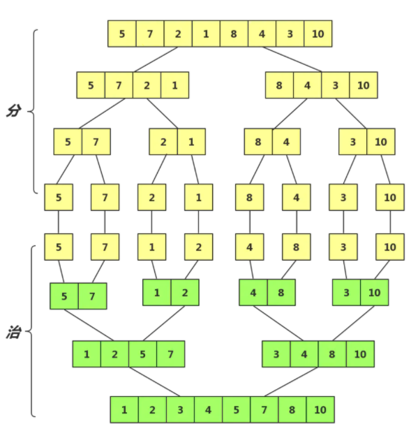
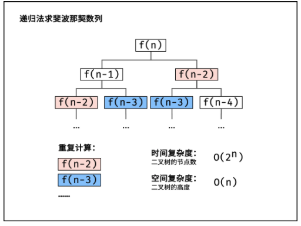

## 冒泡排序

他是最慢的排序算法之一，数据值会像气泡一样从数组的一端漂浮到另一端

### 原理

比较相邻的元素，如果第一个比第二个大就交换他们两个，元素向上移动至正确的顺序，就好像气泡升到表面一样，**时间复杂度 O(n^2)**

### 代码实现

```js
function bubbleSort(arr) {
  for (let i = 0; i < arr.length; i++) {
    for (let j = 0; j < arr.length - 1 - i; j++) {
      if (arr[j] > arr[j + 1]) {
        [arr[j], arr[j + 1]] = [arr[j + 1], arr[j]];
      }
    }
  }
  return arr;
}
console.log(bubbleSort([1, 3, 6, 2, 8, 9]));
```

## 选择排序

### 原理

从数组的开头开始，将第一个元素和其他元素比较，最小的元素会被放到数组的第一个位置，再从第二个位置继续,**时间复杂度 O(n^2)**

### 代码实现

```js
function selectSort(arr) {
  let len = arr.length;
  let minIndex;
  for (let i = 0; i < len - 1; i++) {
    minIndex = i;
    for (j = i + 1; j < len; j++) {
      if (arr[j] < arr[minIndex]) {
        minIndex = j;
      }
    }
    [arr[i], arr[minIndex]] = [arr[minIndex], arr[i]];
  }
  return arr;
}

console.log('选择', selectSort([1, 3, 6, 2, 8, 9]));
```

## 插入排序

### 原理

类似于人们按数字或字母顺序对数据进行排序后面的要为前面腾位置

### 代码实现

```js
function insertSort(arr) {
  let temp;
  for (let i = 1; i < arr.length; i++) {
    temp = arr[i];
    let j = i;
    console.log(j);
    while (j > 0 && arr[j - 1] > temp) {
      arr[j] = arr[j - 1];
      j--;
    }
    arr[j] = temp;
  }
  return arr;
}
console.log('插入', insertSort([1, 3, 6, 2, 8, 9]));
```

## 快速排序

### 原理

在列表中选择一个元素作为基准值，排序围绕这个基准值进行，将列表中小于基准值发放入数组底部，大于放顶部，**时间复杂度是 O(nlog(n))**

### 代码实现

```js
function quickSort(arr) {
  if (arr.length < 2) return arr;
  let privotIndex = Math.floor(arr.length / 2);
  let privot = arr.splice(privotIndex, 1)[0];
  let left = [],
    right = [];
  for (let i = 0; i < arr.length; i++) {
    if (arr[i] < privot) {
      left.push(arr[i]);
    } else {
      right.push(arr[i]);
    }
  }
  return quickSort(left).concat([privot], quickSort(right));
}
console.log('快排', quickSort([1, 3, 6, 2, 8, 9]));
```

## 归并排序

### 原理

把一系列排好序的子序列合并成一个大的完整有序序列，主要是分治思想，**时间复杂度是 O(nlog(n))**

<!--  -->


### 代码实现

```js
function mergeSort(arr) {
  if (arr.length < 2) return arr;
  let mid = Math.floor(arr.length / 2);
  let leftArr = arr.slice(0, mid);
  let rightArr = arr.slice(mid);
  return merge(mergeSort(leftArr), mergeSort(rightArr));
}
function merge(left, right) {
  var result = [];
  while (left.length && right.length) {
    if (left[0] < right[0]) {
      result.push(left.shift());
    } else {
      result.push(right.shift());
    }
  }
  while (left.length) {
    result.push(left.shift());
  }
  while (right.length) {
    result.push(right.shift());
  }
  return result;
}
console.log('归并', mergeSort([1, 3, 6, 2, 8, 9]));
```

## 顺序搜索

### 原理

顺序搜索是最基本的搜索算法，他的机制是将数据结构中的每一个元素和我们要找的元素作比较，顺序搜索是最低效的一种搜索算法
**时间复杂度为 O(n)**

### 代码实现

```js
function sequentialSearch(arr, value) {
  for (let i = 0; i < arr.length; i++) {
    if (value === arr[i]) {
      return i;
    }
  }
  return -1;
}
console.log('顺序搜索', sequentialSearch([1, 3, 6, 2, 8, 9], 0));
```

## 二分查找

这个算法的原理和猜数字的游戏原理很相似，选中一个数字，别人说是高了还是低了，高了就往小区域走，低了就往大区域走

这个算法要求查找的数组**已经排好序,时间复杂度是 O(log(n))**

### 递归法

```js
function binarySearch2(arr, value, start, end) {
  let left = start || 0,
    right = end || arr.length - 1;
  let mid = Math.floor((left + right) / 2);
  if (value === arr[mid]) {
    return mid;
  } else if (value > arr[mid]) {
    return binarySearch2(arr, value, mid + 1, right);
  } else if (value < arr[mid]) {
    return binarySearch2(arr, value, 0, mid - 1);
  }
}
console.log('二分递归：', binarySearch([1, 2, 3, 4, 5, 6, 7, 8], 4));
```

### 非递归法

使用双指针

```js
function binarySearch(arr, value) {
  let left = 0,
    right = arr.length - 1;
  while (left < right) {
    let mid = Math.floor(right + 1 / 2);
    if (arr[mid] > value) {
      right = mid - 1;
    } else if (arr[mid] < value) {
      left = mid + 1;
    } else {
      return mid;
    }
  }
  return false;
}
console.log('二分非递归：', binarySearch([1, 2, 3, 4, 5, 6, 7, 8], 4));
```

## 内插搜索

### 原理

将二分查找的点改进为 mid=low+(key-a[low])/(a[high]-a[low])\*(high-low)

基本思想：基于二分查找算法，将查找点的选择改进为自适应选择，可以提高查找效率。当然，差值查找也属于有序查找。

注：对于表长较大，而关键字分布又比较均匀的查找表来说，插值查找算法的平均性能比折半查找要好的多。反之，数组中如果分布非常不均匀，那么插值查找未必是很合适的选择。

复杂度分析：查找成功或者失败的时间复杂度均为 O(log2(log2n))。

### 代码实现

```js
function InsertionSearch(arr, val, start, end) {
  var end = end || data.length - 1;
  var start = start || 0;

  var mid =
    start + ((val - arr[low]) / (arr[end] - arr[start])) * (end - start);
  if (arr[mid] == val) {
    return mid;
  }

  if (arr[mid] > val) {
    return InsertionSearch(arr, val, start, mid - 1);
  } else {
    return InsertionSearch(arr, val, mid + 1, end);
  }
}
```

## 理解递归

递归是一种解决问题的方法，他从解决问题的各个小部分开始，直到解决最初的大问题，递归通常涉及到调用自身

## 为什么要用递归？

因为在某些场景下，使用递归更容易理解，而且代码量很少，但是递归不代表速度快

## 计算一个数的阶乘

例如 5!,就是 5*4*3*2*1

**代码实现**

```js
function factorial(n) {
  if (n === 1 || n === 0) {
    return 1;
  }
  return n * factorial(n - 1);
}
console.log('递归阶乘', factorial(10));
```

## 斐波那契数列

```js
function fibonacci(n) {
  if (n < 1) return 0;
  if (n < 2) return 1;
  return fibonacci(n - 1) + fibonacci(n - 2);
}
console.log('斐波那契数', fibonacci(9));
```

## 尾递归

函数调用自身，称为递归。如果尾调用自身，就称为尾递归。

上面阶乘的代码可以改成**尾递归**

```js
const newFact = n => {
  return fact(n, 1);
};
const fact = (n, product) => {
  if (n == 1) {
    return product;
  } else {
    return fact(n - 1, n * product);
  }
};
console.log('尾递归', newFact(10));
```

上面的斐波那契数列可以改成**记忆化递归法**：

在递归法的基础上，新建一个长度为 nn 的数组，用于在递归时存储 f(0)f(0) 至 f(n)f(n) 的数字值，重复遇到某数字则直接从数组取用，避免了重复的递归计算

```js
//记忆化递归法
var fib = function(n) {
  let fibonacci = [0, 1];
  for (let i = 2; i <= n; i++) {
    fibonacci[i] = (fibonacci[i - 1] + fibonacci[i - 2]) % 1000000007;
  }
  return fibonacci[n];
};
```

## 动态递归

以斐波那契数列性质 f(n + 1) = f(n) + f(n - 1)f(n+1)=f(n)+f(n−1) 为转移方程

<!--  -->


**动态规划解析：**

- 状态定义： 设 dpdp 为一维数组，其中 dp[i]dp[i] 的值代表 斐波那契数列第 ii 个数字 。
- 转移方程： dp[i + 1] = dp[i] + dp[i - 1]dp[i+1]=dp[i]+dp[i−1] ，即对应数列定义 f(n + 1) = f(n) + f(n - 1)f(n+1)=f(n)+f(n−1) ；
- 初始状态： dp[0] = 0dp[0]=0, dp[1] = 1dp[1]=1 ，即初始化前两个数字；
- 返回值： dp[n]dp[n] ，即斐波那契数列的第 nn 个数字。

```js
var fib = function(n) {
  let dp = [0, 1];
  function f(n) {
    if (dp[n] != undefined) {
      return dp[n];
    }
    dp[n] = f(n - 1) + f(n - 2);
    return dp[n] % 1000000007;
  }
  return f(n);
};
```
## 贪心算法概念

是一种寻找**最优解**为手段达成整体解决方案的算法，这些优质的解决方案称为**局部最优解**，将有希望得到正确答案的最终解决方案称为**全局最优解**，**贪心**会用那些进户无法找到完整解决方案的问题，次优解也是可以接受的

```js
//贪心算法找零问题：50块、10块、5块、1块
function mackChange(orginRmb, coins) {
  var remainRmb = 0;
  if (orginRmb % 50 < orginRmb) {
    coins[3] = parseInt(orginRmb % 50, 10);
    remainRmb = orginRmb % 50;
    orginRmb = remainRmb;
  }
  if (orginRmb % 10 < orginRmb) {
    coins[2] = parseInt(orginRmb % 10, 10);
    remainRmb = orginRmb % 10;
    orginRmb = remainRmb;
  }
  if (orginRmb % 5 < orginRmb) {
    coins[1] = parseInt(orginRmb % 5, 10);
    remainRmb = orginRmb % 5;
    orginRmb = remainRmb;
  }
  coins[0] = orginRmb % 1;
  return coins;
}
console.log(mackChange(63, []));
```
## 动态规划概念

动态规划是与递归相反的一种技术。递归懂顶部开始分解出多个小问题，合并成一个解决方案，动态规划是从底部分解成很多小问题解决掉，组成解决方案

```js
//斐波那契数列 黄金分割数列0、1、1、2、3、5、8、13...
//实现原理 f(0)=0,f(1)=1,f(n)=f(n-1)+f(n-2) (n>2)
function recurFib(n) {
  if (n < 2) {
    return n;
  } else {
    return recurFib(n - 1) + recurFib(n - 2);
  }
}

//动态规划  用数组存的方法 时间复杂度O(n)
function dynFib(n) {
  let value = [];
  value[0] = 0;
  value[1] = 1;
  for (let i = 2; i <= n; i++) {
    value[i] = value[i - 1] + value[i - 2];
  }
  return value[n];
}
console.log('动态规划', dynFib(10));

//动态规划 不用数组 用常量
function iterFib(n) {
  if (n > 0) {
    var last = 1;
    var nextLast = 1;
    var result = 1;
    for (let i = 2; i < n; i++) {
      result = last + nextLast;
      nextLast = last;
      last = result;
    }
    return result;
  } else {
    return 0;
  }
}
console.log('动态规划非数组', iterFib(10));
```
