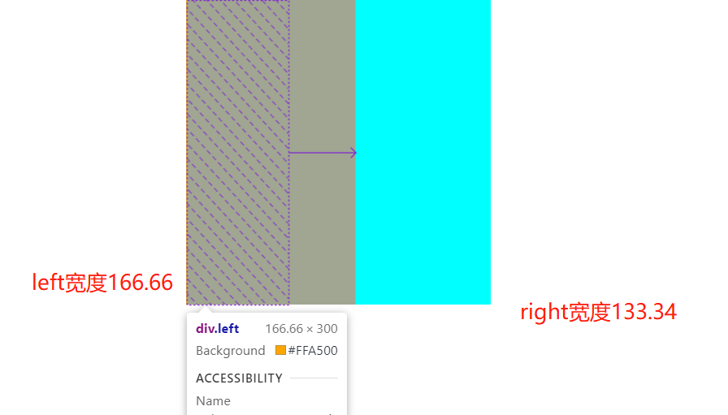
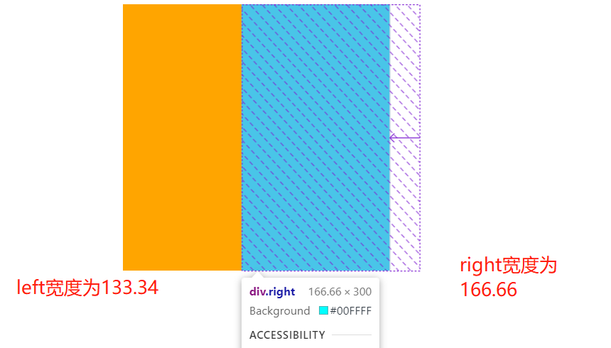
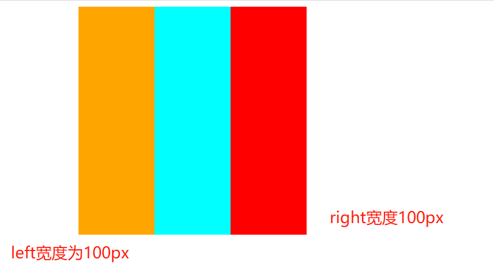

## 1、Html5 和 css3 的新特性

**html5 新特性：**

1. 拖拽释放(Drag and drop) API
2. 语义化更好的内容标签（`header,nav,footer,aside,article,section`）
3. 音频、视频 API(audio,video)
4. 画布(`Canvas`) API
5. 地理(`Geolocation`) API
6. 本地离线存储 `localStorage` 长期存储数据，浏览器关闭后数据不丢失；
7. `sessionStorage` 的数据在浏览器关闭后自动删除
8. 表单控件，`calendar、date、time、email、url、search`
9. 新的技术 `webworker`, `websocket`, `Geolocation`

> 语义化的理解(优点):

- html 语义化就是让页面的内容结构化，便于对浏览器、搜索引擎解析；
- 在没有样式 CCS 情况下也以一种文档格式显示，并且是容易阅读的。
- 搜索引擎的爬虫依赖于标记来确定上下文和各个关键字的权重，利于 SEO。
- 使阅读源代码的人对网站更容易将网站分块，便于阅读维护理解。

**如何区分 html 和 html5**

1. 文档类型声明

   - `html` 声明：`<!DOCTYPE HTML PUBLIC "-//W3C//DTD HTML 4.01 Transitional//EN" "http://www.w3.org/TR/html4/loose.dtd">`

   - `html5`：`<!doctype html>`

2. 结构语义

   - `html`:没有体现结构语义化的标签，通常是用`<div id="header"></div>`来表示头部

   - `html5`:在语义上有很大优势，提供了一些新的 html5 标签，比如：`article、footer、header、nav、section`

## 2、外边距重叠

- 两个相邻的外边距都是正数时，折叠结果是它们两者之间较大的值。
- 两个相邻的外边距都是负数时，折叠结果是两者绝对值的较大值。
- 两个外边距一正一负时，折叠结果是两者的相加的和

> 解决方法
> 父元素添加：`overflow: hidden`

## 3、position 的几个值说一下

- `absolute`

  生成绝对定位的元素，相对于 static 定位以外的第一个父元素进行定位。

- `fixed` （老 IE 不支持）

  生成绝对定位的元素，相对于浏览器窗口进行定位。

- `relative`

  生成相对定位的元素，相对于其正常位置进行定位。

- `static` 默认值。没有定位，元素出现在正常的流中

  （忽略 top, bottom, left, right z-index 声明）。

- `inherit` 规定从父元素继承 position 属性的值。
- `sticky` ：粘性定位 sticky 相当于相对定位 relative 和固定定位 fixed 的结合（用于吸顶效果）

## 4、css 实现多列等高布局，要求元素实际占用的高度以多列中较高的为准！

1. 第一种使用 `flex` 布局，`flex-direction` 默认为 row,align-items 默认为 stretch，该参数就是元素被拉伸适应容器

```html
<!DOCTYPE html>
<html lang="en">
  <head>
    <meta charset="UTF-8" />
    <meta name="viewport" content="width=device-width, initial-scale=1.0" />
    <title>Document</title>
    <style type="text/css">
      .wrap {
        display: flex;
        /* flex-direction: row;
        align-items: stretch; */
      }
      .item {
        width: 0;
        flex: 1;
        margin-right: 5px;
        background-color: burlywood;
      }
    </style>
  </head>
  <body>
    <div class="wrap">
      <div class="item">left</div>
      <div class="item">
        <p>1</p>
        <p>1</p>
        <p>1</p>
        <p>1</p>
        <p>1</p>
      </div>
      <div class="item">right</div>
    </div>
  </body>
</html>
```

2. `table-cell` 布局

```html
<!DOCTYPE html>
<html lang="en">
  <head>
    <meta charset="UTF-8" />
    <meta name="viewport" content="width=device-width, initial-scale=1.0" />
    <title>Document</title>
    <style type="text/css">
      .wrap {
        width: 100%;
        display: table;
        background-color: darkblue;
        table-layout: fixed;
      }
      .left,
      .centerWrap,
      .right {
        display: table-cell;
      }
      .left,
      .center,
      .right {
        background: darkkhaki;
      }
      .center {
        margin: 0 10px;
      }
    </style>
  </head>
  <body>
    <div class="wrap">
      <div class="left">left</div>
      <div class="centerWrap">
        <div class="center">
          <p>1</p>
          <p>1</p>
          <p>1</p>
          <p>1</p>
          <p>1</p>
        </div>
      </div>
      <div class="right">right</div>
    </div>
  </body>
</html>
```

3. 假等高布局，给每列设置比较大的底部内边距`padding-bottom`,然后用相等数值的负外边距`margin-bottom`消除掉

```html
<!DOCTYPE html>
<html lang="en">
  <head>
    <meta charset="UTF-8" />
    <meta name="viewport" content="width=device-width, initial-scale=1.0" />
    <title>Document</title>
    <style type="text/css">
      html,
      body,
      p {
        margin: 0;
        padding: 0;
      }
      .wrap {
        overflow: hidden;
        background-color: darkblue;
      }
      .left,
      .centerWrap,
      .right {
        float: left;
        width: 33.33%;
        padding-bottom: 9999px;
        margin-bottom: -9999px;
      }
      .left,
      .center,
      .right {
        background: darkorchid;
      }
      .center {
        margin: 0 10px;
      }
    </style>
  </head>
  <body>
    <div class="wrap">
      <div class="left">left</div>
      <div class="centerWrap">
        <div class="center">
          <p>1</p>
          <p>1</p>
          <p>1</p>
          <p>1</p>
          <p>1</p>
        </div>
      </div>
      <div class="right">right</div>
    </div>
  </body>
</html>
```

4. `grid` 布局
   grid-template-columns 设置列宽， grid-auto-flow 自动布局算法，设置优先填充列，具体教程参考[网格布局](http://www.ruanyifeng.com/blog/2019/03/grid-layout-tutorial.html)

```html
<!DOCTYPE html>
<html lang="en">
  <head>
    <meta charset="UTF-8" />
    <meta name="viewport" content="width=device-width, initial-scale=1.0" />
    <title>Document</title>
    <style type="text/css">
      html,
      body,
      p {
        margin: 0;
        padding: 0;
      }

      .wrap {
        display: grid;
        grid-template-columns: repeat(3, 33.33%);
        grid-auto-flow: colums;
        grid-gap: 10px;
        background: darkred;
      }
      .item {
        background: darkslateblue;
      }
    </style>
  </head>

  <body>
    <div class="wrap">
      <div class="item">left</div>

      <div class="item">
        <p>1</p>
        <p>1</p>
        <p>1</p>
        <p>1</p>
        <p>1</p>
      </div>

      <div class="item">right</div>
    </div>
  </body>
</html>
```

## 5、居中为什么要用 `transfrom`,而不是使用 `marginLeft、marginTop`?

因为 `margin` 会导致页面重排和重绘，但是 `transfrom` 却不是，`tranfrom` 是创建一个独立的层。

**浏览器渲染过程**

拿 chrome 举例，chrome 渲染主要包括：

- Parse Html(html 解析)
- RecalculateStyle(查找并计算样式）
- Layout(排布)
- Paint(绘制)
- Image Decode(图片解码)
- Image Resize(图片大小设置)
- Composite Layers(合并图层并输出页面到屏幕)，
- 浏览器最终渲染出页面

**tansform 的原理**

transform 是通过创建一个 `RenderLayers`(渲染)合成层，拥有独立的 `GraphicsLayers`(绘图层),每一个 GraphicsLayers 都有一个 Graphics Context，其对应的 RenderLayers 会 Paint 进 Graphics Context 中，合成器(Compositor)最终负责将 Graphics Context 输出的位图合并成最终屏幕展示的图案

**margin**

margin：外边距，定义元素周围的空间；简言之，可以改变元素的位移，在浏览器页面渲染的时候，margin 可以控制元素的位置，也就是说，改变 margin，就会改变 render tree 的结构，必定会引起页面 layout 的`重排`和 repaint 的`重绘`

**transform 的局限性**

transform 实际上是用到了 GPU 加速，也就是说占用了内存，由此可见创建 GraphicsLayers,虽然节省了 layout,paint 接收端，但是 layer 创建的越多，占用内存就会越大，过多的渲染开销会超过性能的改善

**独立的合成层**

- 有 `3D` 或者 perspective transform 的 css 属性
- `video` 元素的层
- `canvas` 元素的层
- `flash`
- 对 opacity 和 transform 应用了 css 动画的层
- 使用了 css `滤镜`(filtters)
- 有合成后代的层
- 同合成层重叠，且在该合成层上面(z-index)的渲染

## 6、flex 布局实现把 9 个元素分三行排列?

```html
<!DOCTYPE html>
<html lang="en">
  <head>
    <meta charset="UTF-8" />
    <meta name="viewport" content="width=device-width, initial-scale=1.0" />
    <title>Document</title>
    <style type="text/css">
      .content {
        display: flex;
        flex-flow: row wrap; /* 换行 */
        justify-content: center;
        align-items: center;
      }
      .item {
        flex: 0 1 33.33%; /* 宽度 */
        padding: 15px 0;
        text-align: center; /*  或者 display: flex; */
        border-bottom: 1px solid #efefef;
        border-right: 1px solid #efefef;
        box-sizing: border-box;
      }
    </style>
  </head>
  <body>
    <div class="content">
      <div class="item">商铺</div>
      <div class="item">商铺</div>
      <div class="item">商铺</div>
      <div class="item">商铺</div>
      <div class="item">商铺</div>
      <div class="item">商铺</div>
      <div class="item">商铺</div>
      <div class="item">商铺</div>
      <div class="item">商铺</div>
    </div>
  </body>
</html>
```

## 7、实现一个固定宽度为 200px 的 div 在页面水平垂直居中（至少一种）?

### flex 方法

```html
<!DOCTYPE html>
<html lang="en">
  <head>
    <meta charset="UTF-8" />
    <meta name="viewport" content="width=device-width, initial-scale=1.0" />
    <title>Document</title>
    <style type="text/css">
      .main {
        display: flex;
        flex-direction: row;
        align-items: center;
        justify-content: center;
        height: 100vh;
      }
      .box {
        background: red;
      }
    </style>
  </head>
  <body>
    <div class="main">
      <div class="box">xdadsadsadasdasd</div>
    </div>
  </body>
</html>
```

### 绝对定位方法(不知道宽高)

不确定当前 `div` 的宽度和高度，采用 `transform: translate(-50%,-50%);`当前 `div` 的父级添加相对定位`（position: relative;）`

```html
<!DOCTYPE html>
<html lang="en">
  <head>
    <meta charset="UTF-8" />
    <meta name="viewport" content="width=device-width, initial-scale=1.0" />
    <title>Document</title>
    <style type="text/css">
      .main {
        position: relative;
        height: 100vh;
      }
      .box {
        background: red;
        position: absolute;
        left: 50%;
        top: 50%;
        transform: translate(-50%, -50%);
      }
    </style>
  </head>
  <body>
    <div class="main">
      <div class="box">sdasdsawdddddddddddd</div>
    </div>
  </body>
</html>
```

### 绝对定位(知道宽高)

确定`div`的宽高

```css
//第一种
.box {
  background: red;
  position: absolute;
  left: 0;
  top: 0;
  bottom: 0;
  right: 0;
  margin: auto;
  width: 100px;
  height: 100px;
}
//第二种
.box {
  background: red;
  width: 100px;
  height: 100px;
  position: absolute;
  left: 50%;
  top: 50%;
  margin-left: -50px;
  margin-top: -50px;
}
```

## 8、flex 布局的三个属性的理解？

我们先来了解一下 `flex-grow`、`flex-shrink`、`flex-basis` 这三个元素是个啥？

- `flex-grow`：`grow` 的中文意思是扩大，用来分配父元素剩余空间的相对比例。默认值为 0

  ```html
  <!DOCTYPE html>
  <html lang="en">
    <head>
      <meta charset="UTF-8" />
      <meta http-equiv="X-UA-Compatible" content="IE=edge" />
      <meta name="viewport" content="width=device-width, initial-scale=1.0" />
      <title>Document</title>
      <style>
        .flex-box {
          display: flex;
          width: 300px;
          height: 300px;
          margin: 0 auto;
          background: #f00;
        }
        .left {
          flex-grow: 2;
          width: 100px;
          background-color: orange;
        }
        .right {
          flex-grow: 1;
          width: 100px;
          background-color: cyan;
        }
      </style>
    </head>
    <body>
      <div class="flex-box">
        <div class="left"></div>
        <div class="right"></div>
      </div>
    </body>
  </html>
  ```

  效果如图：
  

  > 结论就是：当子元素的宽度之和小于父元素的宽度的时候，两个盒子根据设置的`flex-grow`来根据比例分剩下的空间，如上例就是根据比例来分剩余的 100px

  - `flex-shrink`：`shrink`的中文意思是收缩，用来指定`flex`元素的收缩规则，默认值为 1

  ```html
  <!DOCTYPE html>
  <html lang="en">
    <head>
      <meta charset="UTF-8" />
      <meta http-equiv="X-UA-Compatible" content="IE=edge" />
      <meta name="viewport" content="width=device-width, initial-scale=1.0" />
      <title>Document</title>
      <style>
        .flex-box {
          display: flex;
          width: 300px;
          height: 300px;
          margin: 0 auto;
          background: #f00;
        }
        .left {
          flex-shrink: 2;
          width: 200px;
          background-color: orange;
        }
        .right {
          flex-shrink: 1;
          width: 200px;
          background-color: cyan;
        }
      </style>
    </head>
    <body>
      <div class="flex-box">
        <div class="left"></div>
        <div class="right"></div>
      </div>
    </body>
  </html>
  ```

  效果如图：

  

  > 结论就是：当子元素的宽度之和大于父元素的宽度的时候，两个盒子根据设置的`flex-shrink`来收缩，比如上例所说就是`flex-shrink`参数越大收缩的越多

- `flex-basis`：`basis` 的中文意思是基准，用来指定子元素内容盒尺寸大小。默认值为 `auto`

  ```html
  <!DOCTYPE html>
  <html lang="en">
    <head>
      <meta charset="UTF-8" />
      <meta http-equiv="X-UA-Compatible" content="IE=edge" />
      <meta name="viewport" content="width=device-width, initial-scale=1.0" />
      <title>Document</title>
      <style>
        .flex-box {
          display: flex;
          width: 300px;
          height: 300px;
          margin: 0 auto;
          background: #f00;
        }
        .left {
          flex-basis: 100px;
          width: 100px;
          background-color: orange;
        }
        .right {
          /* flex-basis: 1; */
          width: 100px;
          background-color: cyan;
        }
      </style>
    </head>
    <body>
      <div class="flex-box">
        <div class="left"></div>
        <div class="right"></div>
      </div>
    </body>
  </html>
  ```

  效果如图：

  

  > 结论就是：`flex-basis`只是根据设置的宽度来显示

**综上所述**
`flex-grow`：值大于 `0`，主要是解决父元素宽度大于所有子元素宽度之和时，子元素合理分配父元素剩余空间。值为 `0` 时，子元素盒子空间不做扩大处理。
`flex-shrink`：值大于 `0`，主要是解决父元素宽度小于所有子元素宽度之和时，子元素缩小宽度以适应父元素宽度，值为 `0` 时，子元素盒子空间不做缩小处理。
`flex-basis`：其实也可以理解为在 `flex` 布局下，一个高优先级的宽度

### 一道 flex 面试题

看下面的代码，说出`left`和`right`的宽度分别是多少?

```html
<!DOCTYPE html>
<html lang="en">
  <head>
    <meta charset="UTF-8" />
    <meta http-equiv="X-UA-Compatible" content="IE=edge" />
    <meta name="viewport" content="width=device-width, initial-scale=1.0" />
    <title>Document</title>
    <style>
      .flex-box {
        display: flex;
        width: 300px;
        height: 300px;
        margin: 0 auto;
        background: #f00;
      }
      .left {
        flex: 3 2 100px;
        background-color: orange;
      }
      .right {
        flex: 2 1 250px;
        background-color: cyan;
      }
    </style>
  </head>
  <body>
    <div class="flex-box">
      <div class="left"></div>
      <div class="right"></div>
    </div>
  </body>
</html>
```

> 答案：首先看最后一项，两者相加之和大于父元素的宽度说明需要收缩，所以超出部分 50px 就根据`flex-shrink`设置的值来分,left 收缩的宽度为：`100px-50px*(100px*2/(100px*2+250px*1))=77.78px`，right 收缩的宽度为`250px-50px*(250px*1/(100px*2+250px*1))=222.23px`
