# ios 开发和上架证书创建

## 1、首先是创建开发者账号

| 开发者类型 | 说明             | 申请周期 | 费用  | 其它                                                                                                  |
| ---------- | ---------------- | -------- | ----- | ----------------------------------------------------------------------------------------------------- |
| 个人       | App Store 上发布 | 一周     | 99\$  | 只能有一个开发者，需要提供个人信用卡信息，只能装 100 台机器                                           |
| 公司       | App Store 上发布 | 两到三周 | 99\$  | 可以有多个开发者，除信用卡外还需要授权许可，公司地址，公司唯一号，只能装 100 台机器，需要申请邓白氏码 |
| 企业       | 企业内部发布     | 两到三周 | 299\$ | 不限制台数，发布内部 App,不限制设备，代码级别的技术支持，需要申请邓白氏码                             |

## 2、登录苹果开发者账号

登录[苹果开发者网站](https://developer.apple.com/account)，进入首页选择`Certificates, IDs & Profiles`

  <!--  -->
  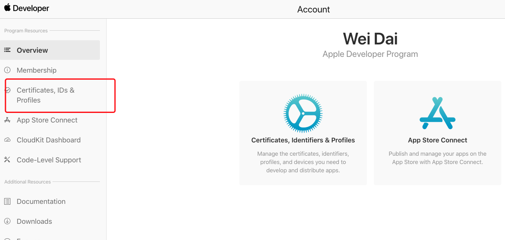

## 3、首先进入 Identifiers 注册 AppID 信息

  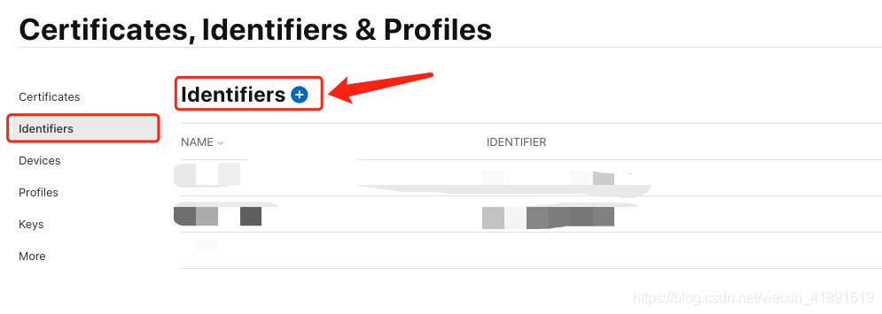
  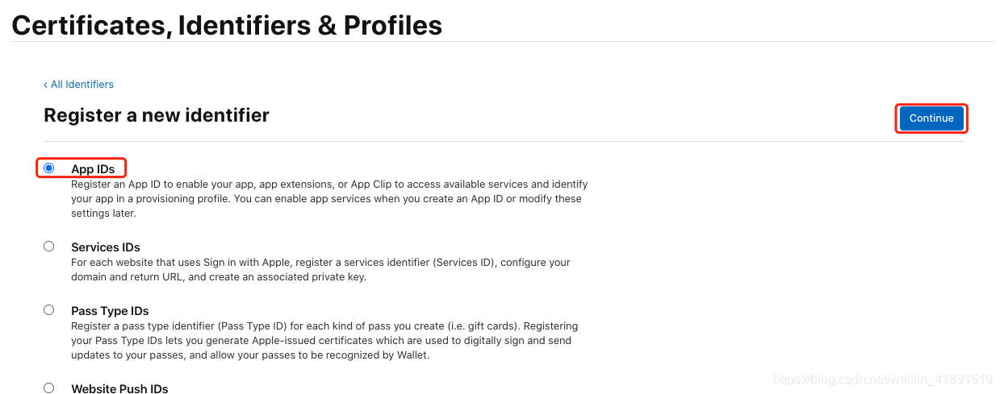
  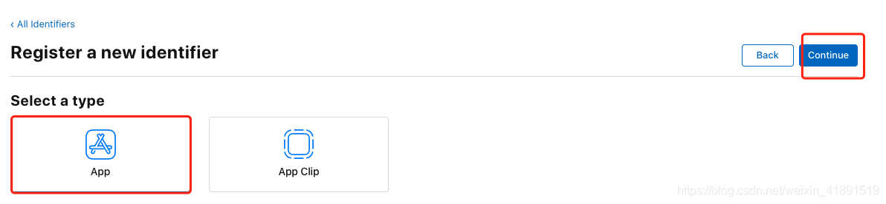
  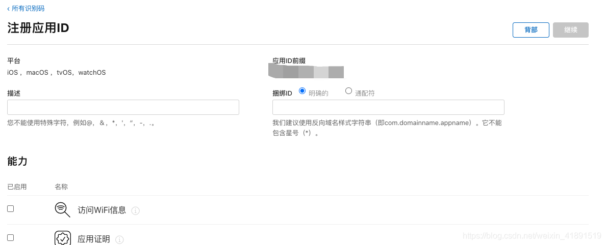
  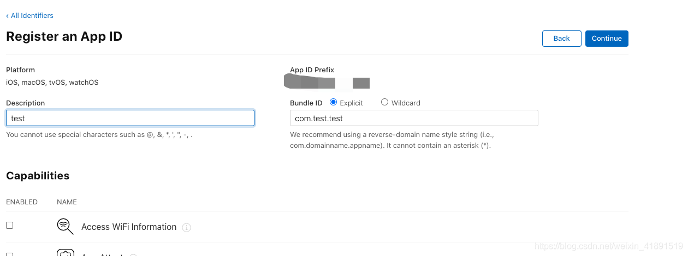

然后点击`continue`就能在列表里面看到这个`AppId`了

## 4、申请证书

### 4.1、创建本地`CSR证书`

mac 上打开钥匙串程序，

  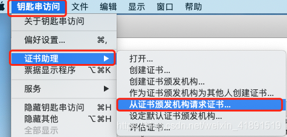
  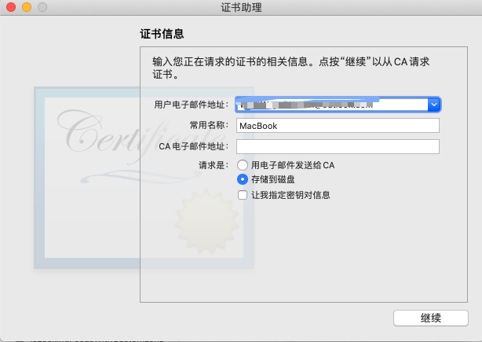

### 4.2、申请开发者证书

  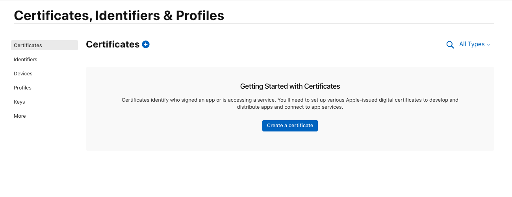
  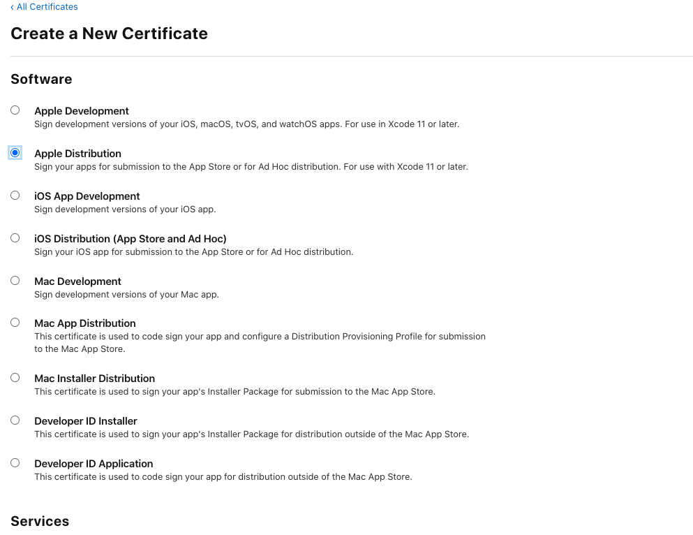

**前四项都要申请**

下一步要选择的文件就是上一步创建的本地`CSR`文件

## 5、申请描述文件

开发者描述文件，便与本地开发打测试包

<!--  -->
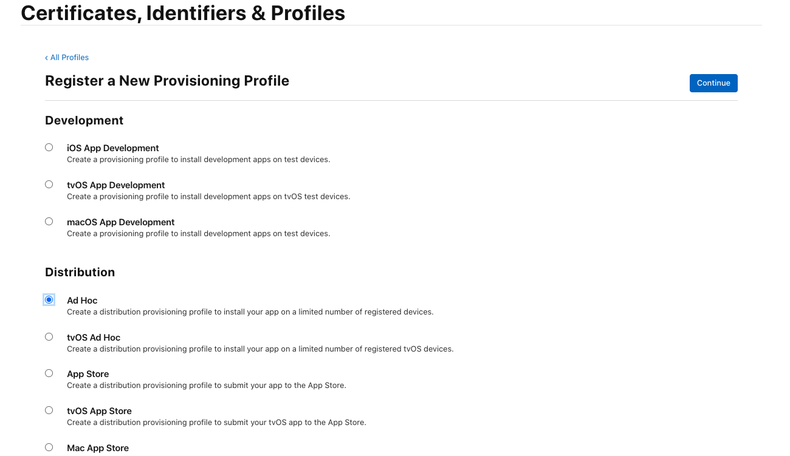

打包上传到`app store`的描述文件

<!--  -->
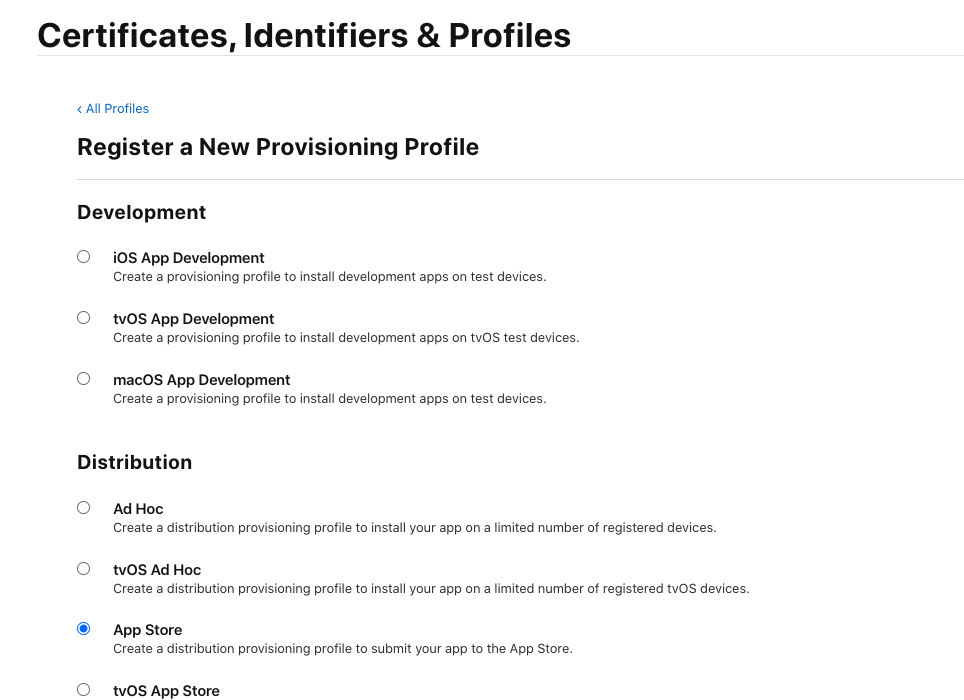

主要是选择`Ad Hoc`和`App store`这两种描述文件，下一步就按照之前创建的 appId 选就行了

## 6、 ios 测试包的打包安装

### 首先下载 itools

1. 首先下载[itools](https://www.itools.cn/),如果是 window 则直接在浏览器搜索找到该图所对应的网址 点普通下载即可。

<!--  -->
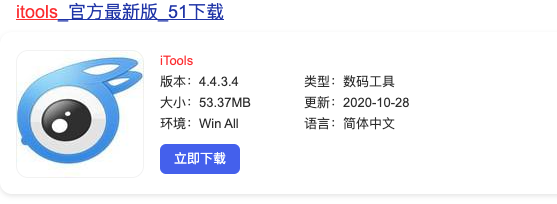

2. 安装好 itools 之后 打开，使用数据线链接电脑和手机，如果是 mac 电脑的就会显示该页面

<!--  -->
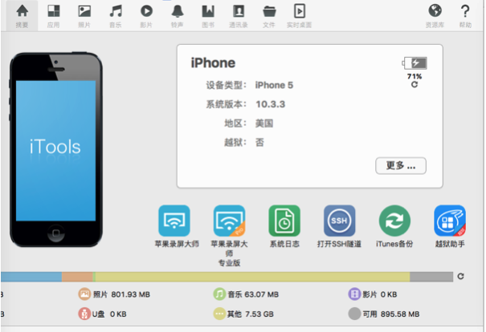

点击更多找到**设备标识**，复制**设备标识**

### 登录苹果开发者网站

登录[苹果开发者网站](https://developer.apple.com),找到下面图对应的`Certificates ,IDs & Profiles`

<!--  -->
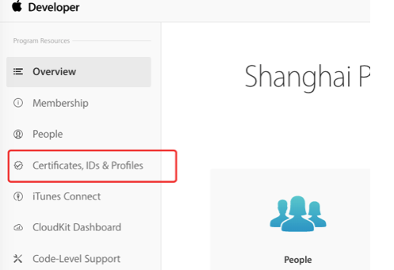

选择`Devices`,然后添加从`itools`里面查看到的设备标识，按照指示点击下一步，完成设备的添加

<!--  -->
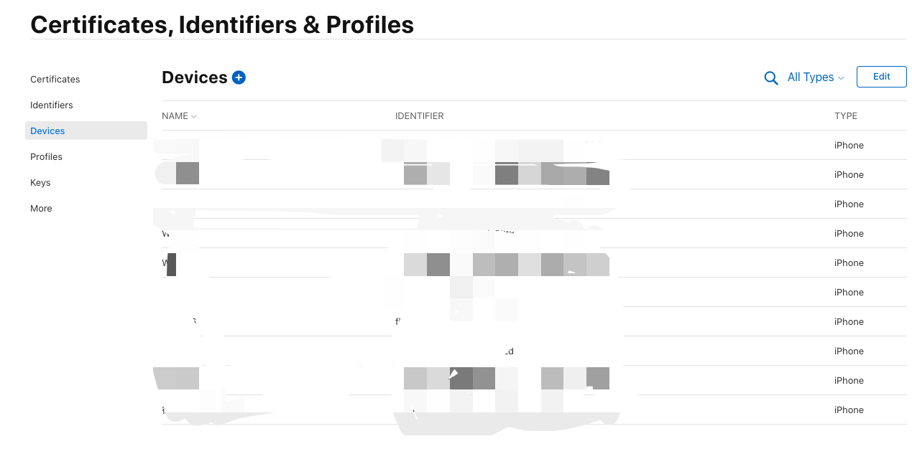

<!--  -->
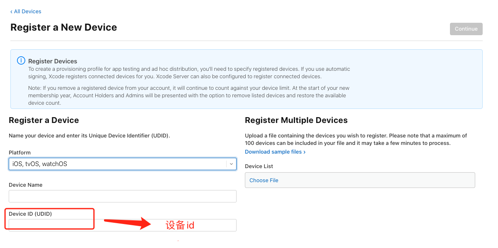

### 重新下载描述文件

点击侧边栏`Profiles`,选择对应的`AppId`的开发描述文件

<!--  -->
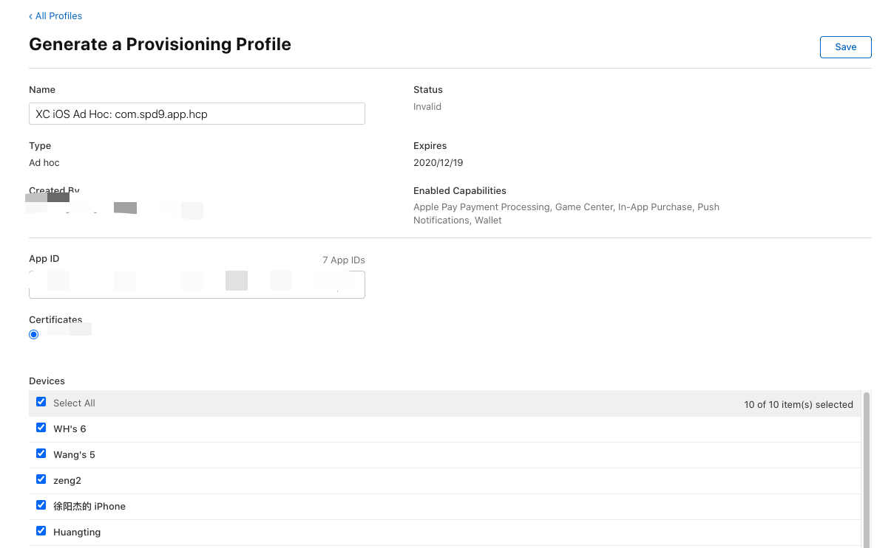

选择之前创建好的开发描述文件，点击编辑，把`devices`全部勾选，然后保存下载，双击安装，重新打包就能安装在手机上了。
