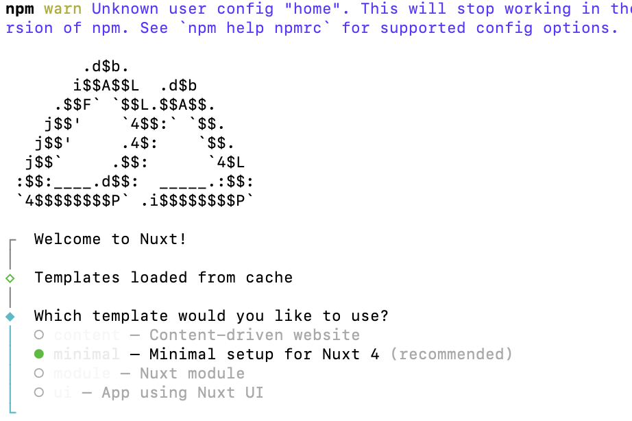

# Vue Nuxt使用

## 1、创建nuxt项目
```bash
# node >18 版本才能使用
npx nuxi init nuxt-demo
```
执行之后出现如下界面选择



- Content-driven website（内容驱动网站）
    - 适合内容丰富的网站，如博客、新闻网站等
- minimal（已选中，推荐）
    - 适合新手/学习/通用项目首选
    - 最干净的Nuxt4起步模板
    - 只保留核心能力(路由、SSR、API)
- Nuxt module（Nuxt模块）
    - 适合想写Nuxt插件/模块，发布给社区用
    - 提供了丰富的插件和模块，如认证、内容管理、SEO等
- App using Nuxt UI（Nuxt UI应用）
    - 适合想使用Nuxt UI组件库的应用
    - 提供了丰富的组件，如按钮、输入框、下拉菜单等